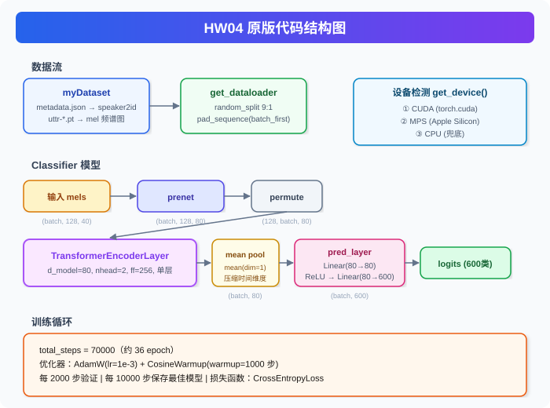

# HW04 — Speaker Recognition (说话人识别)

> ML2021-Spring | 基于 Transformer 的音频说话人分类

## 原版结构图

## 任务目标

- **Easy**：跑通示例代码，理解 Transformer 用法
- **Medium**：调参优化 Transformer 性能
- **Hard**：实现 [Conformer](https://arxiv.org/abs/2005.08100)（卷积增强 Transformer）

## 数据集

| 项目 | 内容 |
|---|---|
| 来源 | [Voxceleb1](https://www.robots.ox.ac.uk/~vgg/data/voxceleb/) |
| 说话人数量 | 600 类 |
| 训练样本 | 69438 条梅尔频谱特征（.pt） |
| 测试样本 | 6000 条（无标签） |
| 输入特征 | 40 维梅尔频谱，裁剪为 128 帧片段 |

## 版本参数对照

| 参数 | 初始版 | 当前工作区版 | 预计修改版（冲 strong baseline 0.95） |
|---|---:|---:|---:|
| 主体结构 | TransformerEncoderLayer | ConformerEncoder | ConformerEncoder |
| 输入特征 | 40 维 mel | 40 维 mel | 40 维 mel |
| segment_len | 128 | 128 | 128 |
| d_model | 80 | 80 | 256 |
| encoder 层数 | 1 | 2 | 4 |
| attention heads | 2 | 2 | 4 |
| dim_feedforward | 256 | 256 | 1024 |
| Conformer conv kernel | 无 | 31 | 31 |
| dropout | 0.1 | 0.3 | 0.15 |
| pooling | mean pooling | mean pooling | attentive statistics pooling |
| 分类头 | Linear(80→80) → ReLU → Linear(80→600) | Linear(80→80) → ReLU → Linear(80→600) | Linear(512→256) → BatchNorm1d → ReLU → Dropout → Linear(256→600) |
| batch_size | 32 | 64 | 64 |
| warmup_steps | 1000 | 1000 | 4000 |
| total_steps | 70000 | 70000 | 120000 |
| valid_steps | 2000 | 2000 | 2000 |
| save_steps | 10000 | 10000 | 10000 |
| optimizer | AdamW(lr=1e-3) | AdamW(lr=1e-3) | AdamW(lr=1e-3) |
| scheduler | CosineWarmup | CosineWarmup | CosineWarmup |
| loss | CrossEntropyLoss | CrossEntropyLoss | CrossEntropyLoss |

## 预计修改版说明

预计修改版暂时只作为参数方案记录，未直接改写 `HW04.ipynb`。

核心思路：

- 提升模型容量：`d_model=80 → 256`，Conformer 层数 `2 → 4`。
- 降低过强正则：`dropout=0.3 → 0.15`。
- 改善说话人表征聚合：用 attentive statistics pooling 替代简单 mean pooling，同时保留均值和标准差信息。
- 延长训练：`total_steps=70000 → 120000`，并把 warmup 调到 4000 步。

## 关键文件

| 文件 | 说明 |
|---|---|
| `HW04.ipynb` | 完整代码（数据加载 + 模型 + 训练 + 推理） |
| `ml2021spring-hw4/` | 数据目录（metadata.json / mapping.json / testdata.json） |
